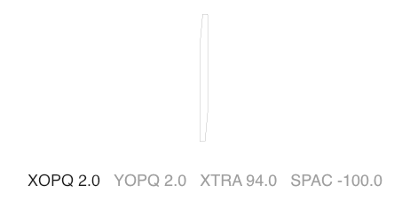
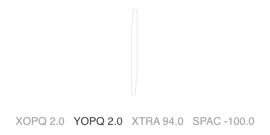
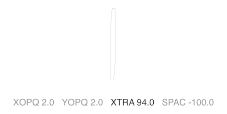
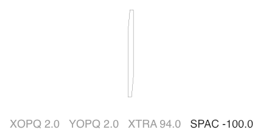

# Crispy — Designspace reference

> Status: **draft** · Last updated: 2026-05-27
>
> This document is the reference for Crispy's designspace — the axes
> it currently ships with, their actual ranges in the live font, how
> parametric axes feed traditional ones via avar2, and the changes
> planned in the **Phase 2026 work plan**
> ([PHASE_2026.md](PHASE_2026.md)).
>
> Where the shipped font and the avar2-studio metadata disagree, this
> document speaks to **what the font actually does** — the fvar table
> is the source of truth — and notes the metadata gap separately so
> the work plan can close it.
>
> Sections marked _TBD_ will be filled in as the corresponding work
> in the work plan progresses.

---

## Overview

Crispy uses a **dual-axis system**: a set of **parametric axes** that
describe the underlying form (`XOPQ`, `YOPQ`, `XTRA`, `SPAC`), and a
set of **traditional / registered axes** that designers and end-users
expect (`wght`, `wdth`, `opsz`, `cntr`, `ital`). Traditional axis
positions map to parametric positions through an **avar2** table.

The parametric axes are what the masters are actually drawn at. The
traditional axes are the user-facing controls.

---

## Axes — current state

Values are read from the **shipped font's fvar table** (the source of
truth). Where the avar2-studio metadata (carried inside the
[avar2-studio](https://github.com/agyeiagyeiagyei/avar2-studio) tool
that authors the avar2 mappings) disagrees with the fvar, the
disagreement is flagged in the notes.

| Tag    | Name          | Kind         | Min    | Default | Max    | User-facing? |
|--------|---------------|--------------|--------|---------|--------|--------------|
| `XTRA` | X-Transparency| parametric   | 94.0   | 94.0    | 3330.0 | hidden       |
| `XOPQ` | X-Opacity     | parametric   | 2.0    | 2.0     | 1016.0 | hidden       |
| `YOPQ` | Y-Opacity     | parametric   | 2.0    | 2.0     | 462.0  | hidden       |
| `SPAC` | Spacing       | post-process | -100.0 | 0.0     | 110.0  | yes (optional tracking) |
| `opsz` | Optical Size  | traditional  | 12     | 12      | 72     | yes          |
| `wdth` | Width         | traditional  | 52     | 52      | 300    | yes          |
| `wght` | Weight        | traditional  | 100    | 100     | 700    | yes          |
| `cntr` | Contrast      | traditional  | _TBD_  | 0       | _TBD_  | not yet      |
| `ital` | Italic        | traditional  | _TBD_  | 0       | _TBD_  | not yet      |

**Reality vs. metadata gaps to close in the work plan:**

- `wght` max in fvar is **700**, not 900. The metadata advertises
  900 (the GF Axis Registry target). The new master in
  [the work plan §2](PHASE_2026.md#2-the-new-filled-out-narrow-master)
  will fill in 701–900 so the fvar catches up.
- `SPAC` range in fvar is **-100 to 110**, not 0–100. The metadata
  advertises -1000 – 1000, which is wrong on both sides. Closing this
  is part of [the work plan §5](PHASE_2026.md#5-recalibrating-core-spacing).
- **Default coordinates** of the variable font sit at the **minimum**
  of every axis (`wght=100, wdth=52, opsz=12, XTRA=94, XOPQ=2, YOPQ=2`),
  so a tool that reads the font with no axis overrides sees Thin
  Condensed at small optical size — see
  [#42](https://github.com/agyeiagyeiagyei/Crispy/issues/42).
- `wdth` max should be ≤200 and `XTRA` max should be ≤2000 per the
  GF Axis Registry — see
  [#47](https://github.com/agyeiagyeiagyei/Crispy/issues/47) and
  [the work plan §4](PHASE_2026.md#4-redefining-the-width-axis).

---

## Parametric axes (what the masters are drawn at)

### `XOPQ` — X-Opacity

Horizontal opaque (positive) space — the thickness of vertical strokes.

- Range in fvar: 2.0 – 1016.0
- Source of truth: the masters in `sources/Crispy.glyphs`
- Hidden axis (per [#51](https://github.com/agyeiagyeiagyei/Crispy/issues/51) — pending)

### `YOPQ` — Y-Opacity

Vertical opaque (positive) space — the thickness of horizontal strokes.

- Range in fvar: 2.0 – 462.0
- Source of truth: the masters in `sources/Crispy.glyphs`
- Hidden axis (per [#51](https://github.com/agyeiagyeiagyei/Crispy/issues/51) — pending)

### `XTRA` — X-Transparency

Horizontal transparent (negative) space — counters and sidebearings'
horizontal component.

- Range in fvar: 94.0 – 3330.0 (will be capped at 2000 per
  [#47](https://github.com/agyeiagyeiagyei/Crispy/issues/47))
- Source of truth: the masters in `sources/Crispy.glyphs`
- Hidden axis (per [#51](https://github.com/agyeiagyeiagyei/Crispy/issues/51) — pending)

### `SPAC` — Spacing

`SPAC` is a post-process axis added by the build pipeline, not a
parametric axis drawn into the source. See
[`scripts/add-spac-axis-ufo.py`](scripts/add-spac-axis-ufo.py) and
[the work plan §5](PHASE_2026.md#5-recalibrating-core-spacing) for the
architecture.

- Range in fvar: -100.0 – 110.0 (asymmetric; 0 = source sidebearings,
  positive values = loosened, negative = tighter)
- Range advertised in axis metadata: -1000 – 1000 (wrong on both
  sides — to be corrected)
- User-facing: yes, as an optional tracking control

---

## Traditional axes (what the user sees)

### `wght` — Weight

- **Range in the shipped font's fvar: 100 – 700.** The avar2-studio
  metadata advertises 100 – 900 (the GF Axis Registry target);
  reality lags. The new master in
  [the work plan §2](PHASE_2026.md#2-the-new-filled-out-narrow-master)
  draws the heaviest extreme so the next build's fvar can extend to
  900 and match the metadata.
- Named instances run 100 – 700 (Thin → Bold).
- **Default in fvar: 100 (Thin).** This isn't where the named
  "Regular" sits (`wght=400`); it's the minimum of the axis, which
  is what tools that read the font with no overrides will land on.
  See [#42](https://github.com/agyeiagyeiagyei/Crispy/issues/42).

### `wdth` — Width

- Range in fvar: 52 – 300
- Range after the work plan: 52 – 200 (registry-compliant per
  [#47](https://github.com/agyeiagyeiagyei/Crispy/issues/47); see
  [§4](PHASE_2026.md#4-redefining-the-width-axis))
- Defined positions today: 52 (Condensed), 100 (Normal), 182
  (Extended), 300 (Ultra Extended)
- **Default in fvar: 52 (Condensed).** Same problem as `wght`'s
  default — sits at the minimum, not at Normal. Part of
  [#42](https://github.com/agyeiagyeiagyei/Crispy/issues/42).

### `opsz` — Optical Size

- Range in fvar: 12 – 72
- **Default in fvar: 12 (smallest).** Same default-at-minimum issue
  as `wght` and `wdth` —
  [#42](https://github.com/agyeiagyeiagyei/Crispy/issues/42).
- Recalibration in [the work plan §3](PHASE_2026.md#3-redefining-the-optical-size-axis)
  — _TBD_ whether the range expands.

### `cntr` — Contrast

`cntr` is a stylistic axis like `wght` or `wdth`, base `0`. The +/-
contrast variants are expressed as **inverse relationships between
additional `XOPQ` and `YOPQ` values** — heavier on one axis is paired
with lighter on the other, producing the contrast effect. So `cntr`
is an *expression* of the existing `XOPQ`/`YOPQ` parametric pair,
defined through the avar2 mapping in avar2-studio — the same way
`wght` and `wdth` are defined today.

No new parametric axis is added for contrast.

- Default: 0 (uniform stroke — current design)
- Range: _TBD_ in this phase
- User-facing: yes, after the work plan ships

### `ital` — Italic

A new axis introduced by [the work plan §6](PHASE_2026.md#6-the-new-ital-axis).
Initial masters generated by mechanical slant of the existing masters
and then corrected by hand.

- Slant range (degrees): _TBD_
- Axis convention (`ital` 0–1 vs `slnt` signed degrees): _TBD_
- Reverse and forward slants both supported

---

## Avar2 mappings

The mapping from traditional axes to parametric axes lives in
[`sources/Crispy-avar.csv`](sources/Crispy-avar.csv) (authored
through [avar2-studio](https://github.com/agyeiagyeiagyei/avar2-studio))
and is baked into the shipped font's `avar2` table at build time via
[`sources/update_config.py`](sources/update_config.py) +
`gftools builder`.

Each row in the CSV maps a traditional-axis position
(`wght`, `wdth`, `opsz`, `cntr`) to a parametric-axis position
(`XOPQ`, `YOPQ`, `XTRA`, `SPAC`). The build inserts these as `avar2`
mapping entries.

After the work plan, the same mechanism authors the `cntr` mapping
(inverse `XOPQ`/`YOPQ`) and the `ital` mapping.

---

## Planned changes summary

Designspace deltas under [the Phase 2026 work plan](PHASE_2026.md):

| Axis  | Change planned in the work plan |
|-------|---------------------------------|
| `XOPQ` | Set hidden flag (#51); STAT (#52) |
| `YOPQ` | Set hidden flag (#51); STAT (#52) |
| `XTRA` | Range capped at 2000 (#47); hidden flag (#51) |
| `SPAC` | Architecture unchanged; baseline (SPAC=0) sidebearings loosened in the source; metadata range corrected |
| `opsz` | Recalibrated for visible impact at extremes (§3); default fix per #42 |
| `wght` | Heaviest extreme drawn so fvar can reach 900 (new master, §2); default fix per #42 |
| `wdth` | Capped at 200 (#47); rebalanced (§4); default fix per #42 |
| `cntr` | New user-facing mapping via inverse XOPQ/YOPQ |
| `ital` | New axis with reverse + forward slants |

---

## Open questions

- Default values for `XOPQ`, `YOPQ`, `XTRA` (the parametric Regular).
- `cntr` range — symmetric or asymmetric, in what units.
- `ital` axis convention (`ital` 0–1 vs `slnt` degrees).
- Whether `SPAC` metadata range gets corrected to match the shipped
  0–100 (it currently advertises -1000 – 1000, which is misleading).
