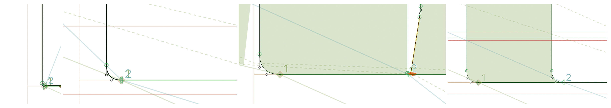
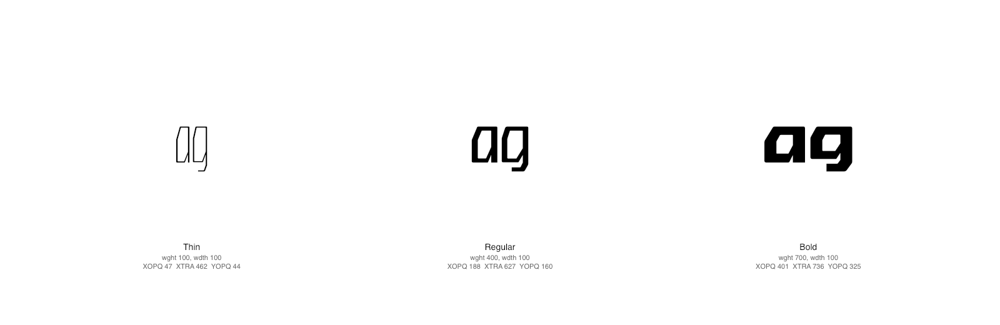
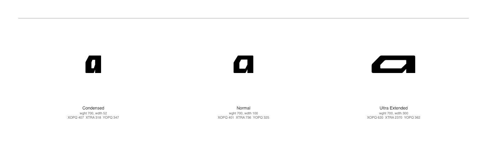
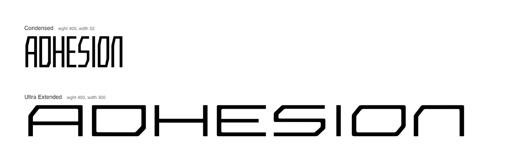

# Crispy — Phase 2026

A funded phase of work on the **Crispy** variable typeface, focused on a
revision of the core design, a missing parametric corner, and the
introduction of the `ital` axis. This document explains the scope to
funders, the design and engineering work to the team, and the direction
to anyone visiting the repo.

A small note: **avar2-studio** — a tool we built during this project
for better avar2 previews — is being pulled out into its own
[standalone repo](https://github.com/agyeiagyeiagyei/avar2-studio) so
any parametric-font designer can use it on their own `.glyphs` file.
It's mentioned here for context; it's not in scope for the design work
that follows.

> Status: planning · Last updated: 2026-05-27 · See also:
> [DESIGNSPACE.md](DESIGNSPACE.md) (designspace reference, in progress)
> and the [open GitHub issues](https://github.com/agyeiagyeiagyei/Crispy/issues).

---

## Summary

This phase ships:

1. **A revised core design** — a sweep across the existing letterforms to
   resolve lagging issues raised in review and to tighten the design
   identity ahead of the v1.x Google Fonts release.
2. **A new "filled-out" master at the narrow width.** Today Crispy's
   heaviest stylistic instance at the condensed extreme (`Bold Condensed`,
   `wght=700, wdth=52`) is reached by extrapolation; this phase adds a
   designed master at that corner so the heaviest narrow weights are
   drawn, not implied.
3. **A redefined optical-size axis.** The current `opsz` axis does not
   carry enough impact at the size extremes; this phase recalibrates
   the masters at both ends so small-size and large-size text are
   visibly distinct from the default.
4. **A redefined width axis.** The current `wdth` range overshoots the
   GF Axis Registry maximum and the visual stepping between widths
   needs work; this phase brings the range into spec and rebalances
   the masters along it.
5. **A recalibration of core spacing.** The masters' built-in
   sidebearings are too tight across the board, and especially so at
   the wider widths where letterforms collide. This phase loosens the
   default spacing, with the increases scaled by width.
6. **Resolution of the open GitHub design issues** filed by Dave
   Crossland, Eben Sorkin, and Marc Foley. See
   [Open issues for this phase](#open-issues-for-this-phase).

The design work in items 1–3 is the centre of this phase. The new
narrow master is the largest single piece of drawing work; OPSZ, WDTH,
and spacing recalibration are calibration sweeps across the existing
masters.

**Sequencing.** Items 1 and 2 come first and are gating: the revised
glyph forms and the new master fix the design that everything
downstream calibrates against. Items 3, 4, 5, and 6 — OPSZ, WDTH,
spacing, and `ital` — cannot begin until items 1 and 2 complete,
because recalibrating against unstable forms would have to be redone.

---

## The design work, in detail

### 1. A revised core design

The v1.003 release surfaced a set of small-but-real design issues across
the alphabet. The revision pass breaks into two specific design tasks
plus a sweep over lingering issues. The first-round deliverable is a
set of designer proposals; the second-round deliverable is the
application of those proposals across the masters.

#### 1a. Regularising corner radii

_Corner widths vary across masters, but the important thing is that
they are consistent in-master and that they relate to each other.
Crispy is a "squarish" font with rounded corners._

Crispy's corner treatment isn't currently consistent across widths
and weights. The goal is to standardise the relationship: **the wider
and thinner the form, the more generous the corner radius; the
narrower the form, the tighter the radius — but never tight enough
that the rounded-ness disappears.** Even at the narrowest widths, a
reader should still register the corners as rounded, not flat.

The standardisation applies to **both internal (concave) and external
(convex) corner radii**, made consistent across every glyph. Today's
masters mix corner treatments — that mix has to resolve into a single
rule that the whole family follows.

The first-round deliverable for this task is a designer proposal for
the standardisation — the rule itself, expressed as a relationship
between width / weight and inside/outside corner radius, with
reference examples across the design space. The second-round work
applies the rule across both the stylistic masters and the parametric
masters.

#### 1b. Regularising thick-thin transitions

_The lowercase `a` and `g` at three weights, held at the same size
and Normal width. The unintentional thick-thin moments inside the
forms get more pronounced as the strokes thicken._

A handful of glyphs carry unideal thick-thin modulation that
adds visual noise to an otherwise even-stroke design. The clearest
examples are the lowercase `a` and `g`, where stroke weight shifts
within the form in ways that don't repeat consistently across widths
or weights.

The first-round deliverable is a designer proposal for the regularised
treatment — how thick-thin moments should resolve so the design reads
even across the whole space. The second-round work applies the
treatment across all masters.

#### 1c. Resolving problematic glyphs

A number of glyphs degrade at the design space extremes:

- Forms that go very tight when very bold — e.g. lowercase `e`,
  whose counter closes up at heavy weights.
- Forms that lose aesthetic quality at narrow widths — e.g.
  lowercase `s`, which can end up resembling a `5` under
  compression.

For each of these glyphs the designer proposes **new forms drawn at
all three widths** (Condensed, Normal, Ultra Extended). Width-switched
alternates — different glyph forms for different widths — are
tolerated where the form fundamentally has to change, but a single
form that works across the width range is preferred: the alternate
switching adds machinery and breaks parametric continuity.

#### 1d. Sweep over open design issues

Alongside 1a–1c, the revision pass picks up the lingering issues:

- Forms that have aged poorly or that read inconsistently across the
  design space (see Eben's notes referenced in
  [#42](https://github.com/agyeiagyeiagyei/Crispy/issues/42)).
- The currency glyphs (dollar, cent, Euro, Sterling) — see
  [#33](https://github.com/agyeiagyeiagyei/Crispy/issues/33).
- The default instance, which currently leaks through tools like
  wakamaifondue and is heavier than the family's identity warrants —
  see [#42](https://github.com/agyeiagyeiagyei/Crispy/issues/42).

### 2. The new filled-out narrow master

_The heaviest weight (`wght=700`) at the three widths currently in
Crispy's designspace, shown at 96pt — roughly the proportions the
user will read in practice. Each glyph is set with the parametric
coordinates (`XOPQ`, `XTRA`, `YOPQ`) that the current avar2 mapping
sends those traditional coordinates to. The new master proposed in
this phase fills in a heavier corner at the narrow end of this
spectrum._

**What it is.** A new designed master at the narrow width and a weight
beyond the current Bold Condensed. Read stylistically it's a "Black
Condensed"-equivalent; read parametrically it adds a corner the family
currently reaches only by extrapolation from interior masters.

**Why it's needed.**

- The heaviest condensed instances today are interpolated/extrapolated
  from masters that weren't drawn with that corner in mind. The forms
  thin out and the spacing breaks down as you push toward narrow + heavy.
- A drawn corner improves interpolation across the whole condensed
  column, not only at the extreme — every condensed instance benefits
  from a master that anchors that end of the space.
- It opens up a stylistically distinct narrow-and-heavy headline use
  case that the family currently can't serve.

**What changes in the designspace.** A new master is added at the
condensed-and-heaviest corner. Width and weight values for it are
TBD pending the design pass; see
[DESIGNSPACE.md](DESIGNSPACE.md) when it lands for the authoritative
table. Avar2 mappings for `wght` and `wdth` are re-derived from the new
designed corner instead of from extrapolation.

**Open design questions** the team needs to resolve:

- The exact width and weight coordinates for the new master.
- How spacing (SPAC) interacts at the new corner — likely a tracking
  adjustment to keep the heaviest narrow forms readable.
- Whether the new master implies any change to the stylistic-instance
  list (e.g. introducing a "Black Condensed" instance to expose the
  corner to end users).

### 3. Redefining the optical-size axis

The current `opsz` axis spans 12–72pt with masters at 12 (`SmallOpsz`)
and 72 (default). In practice the visual difference between sizes feels
too subtle — text rendered at very small or very large sizes looks
similar to default-size text.

This phase recalibrates the existing `SmallOpsz` masters and reconsiders
whether a `LargeOpsz` end is needed. Specific decisions to make:

- Whether to add explicit masters at a `LargeOpsz` extreme (e.g. 144pt)
  or to recalibrate the existing 72pt default to read as "Display" with
  `SmallOpsz` as "Text".
- How `opsz` interacts with the redefined width and the new narrow master
  (each width column needs its own optical-size behaviour to be visibly
  consistent).

### 4. Redefining the width axis

The current `wdth` range runs from 52 (Condensed) to 300 (Ultra
Extended). Two things drive the redefinition:

- **Range alignment.** Marc Foley flagged in
  [#47](https://github.com/agyeiagyeiagyei/Crispy/issues/47) that the GF
  Axis Registry caps `wdth` at 200. The current 300 max needs to come
  down; whether by remapping or by retiring Ultra Extended is a
  design decision for this phase.
- **Stylistic balance.** The visual stepping between Condensed, Normal,
  Extended, and Ultra Extended doesn't feel even. This phase rebalances
  the masters along the redefined range.

The XTRA parametric axis range will also be brought into compliance
(currently 94–3330; registry recommends ≤ 2000) per
[#47](https://github.com/agyeiagyeiagyei/Crispy/issues/47).

### 5. Recalibrating core spacing

_ADHESION at the two width extremes (Condensed, top; Ultra Extended,
bottom), set at the same point size and weight (Regular, `wght=400`).
ADHESION is a long-running spacing test word — its mix of curves
(`D`, `S`, `O`), straights (`H`, `N`, `I`), and joins (`A`, `E`) all
need to read evenly. The wide setting shows what the doc is
describing: the
sidebearings are too tight and letterfors aren't getting enough space to breathe for comfortable uppercase display setting for a font like this

#### How spacing is built today

Crispy's spacing lives in two places, and the distinction matters for
this section.

**Core (default) spacing** is the sidebearings drawn into each master
in the Glyphs source. This is what every user sees when they don't
touch any optional axis — the typeface's default identity.

**SPAC** is an additional, optional spacing axis layered on top by
the build pipeline (see the `make build` target in
[`Makefile`](Makefile) and the
[`scripts/add-spac-axis-ufo.py`](scripts/add-spac-axis-ufo.py)
script). After `fontmake` generates UFOs from the Glyphs source, the
build script duplicates every master twice — a `SPAC=100` variant
with opened-up sidebearings and a `SPAC=-100` variant with tightened
sidebearings — using a logarithmic scaling tied to each master's
`XTRA` value (so wider masters get proportionally more spacing change
in both directions, up to 2× at the widest master; tightened
sidebearings are clamped at zero), and re-compiles. The shipped font
carries a `SPAC` axis from `-100` (the tightened duplicate) through
`0` (the source's actual sidebearings) up to `100` (the loosened
duplicate), and any value in between is interpolated by the variation
engine.

The net effect: end users get a tracking-style slider for optional
breathing room without anyone re-editing the source. **None of the
SPAC architecture is changing in this phase.**

#### What needs to change

What needs to change is the **`SPAC=0` baseline** — the core
sidebearings in the Glyphs source itself. They're tighter than the
design wants. The problem is general — every width benefits from
more breathing room — but it's most visible at the wider widths,
where letterforms collide when the design wants them to sit apart.

SPAC can't paper over this: a user who never touches the SPAC slider
(the common case) gets the tight default and reads the typeface as
cramped. The recalibration has to happen at the source.

This phase increases base spacing across all masters in the Glyphs
file, with the increase scaled by width — most aggressive at Ultra
Extended, more modest at Condensed, but everyone gets some. SPAC
continues to operate on top, automatically picking up the new
baseline (the build duplicates the source masters at compile time,
so the script doesn't need to change for the baseline shift to
propagate).

**Open design questions:**

- The spacing-vs-width curve in the source.
- Interaction with the new corner-radii rule (section 1a) — more
  generous corners eat into perceived spacing and may change the
  increase amount needed.
- Interaction with the redefined width axis (section 4) — if the
  width ramp is rebalanced, the spacing curve has to follow.
- Whether the SPAC build script's logarithmic factor needs a tune
  once the baseline is wider (otherwise the SPAC=100 end may
  over-expand on top of the already-loosened default).
- Whether kerning needs a retouch pass once the base spacing changes.

### 6. The new `ital` axis

**What's planned.** A new `ital` axis with masters at reverse slant
(negative) and forward slant (positive). The initial masters will be
generated automatically (mechanical slant of the existing masters)
and then manually corrected — junctions, overshoots, and forms that
break under simple sheering need designer attention.

**Why.** Italic is the most common axis users expect from a text/display
family and Crispy currently doesn't offer it. Adding both reverse and
forward slants is a parametric-design choice: with avar2, an end user
can express conventional italic via the `ital` slider and the font
applies the right slant + optical correction.

**Open design questions:**

- Slant range (degrees) and whether the axis is signed (typical for
  `slnt`) or 0–1 (typical for `ital`); see the
  [DESIGNSPACE.md](DESIGNSPACE.md) draft.
- Whether reverse-slant gets stylistic-instance exposure or stays
  parametric-only.
- Which glyphs need manual correction after the automated slant
  (likely: rounds, junctions, the lowercase `a`/`e`/`g`, italic-specific
  alternates if any).

---

## Open issues for this phase

| # | Title | Category | Filed by |
|---|---|---|---|
| [42](https://github.com/agyeiagyeiagyei/Crispy/issues/42) | Recalibrate default instance? | Design | davelab6 (citing ebensorkin) |
| [33](https://github.com/agyeiagyeiagyei/Crispy/issues/33) | Review currency (dollar, cent, Euro, Sterling) | Design | agyeiagyeiagyei |
| [47](https://github.com/agyeiagyeiagyei/Crispy/issues/47) | Fix axis ranges to match GF Axis Registry | Conformance | m4rc1e |
| [51](https://github.com/agyeiagyeiagyei/Crispy/issues/51) | Set axis hidden flag on all Parametric Axes | Conformance | davelab6 |
| [52](https://github.com/agyeiagyeiagyei/Crispy/issues/52) | Improve STAT table | Conformance | davelab6 |
| [40](https://github.com/agyeiagyeiagyei/Crispy/issues/40) | v1.003 initial release review | Release | davelab6 |
| [30](https://github.com/agyeiagyeiagyei/Crispy/issues/30) | fontc | Tooling — _resolved via avar2-studio_ | davelab6 |

#30 is effectively complete: the project builds with `fontc` via
`gftools builder --experimental-fontc`, and the avar2-studio preview
tool uses it for build-on-save. The issue should be closed at the end
of this phase.

---

## Designspace today and after

A reference document — [DESIGNSPACE.md](DESIGNSPACE.md) — describes the
designspace in full. Short version:

**Today.** Crispy ships four parametric axes (`XOPQ`, `YOPQ`, `XTRA`,
`SPAC`) plus the registered traditional axes (`opsz`, `wght`, `wdth`)
mapped from parametric values via the avar2 table.

**`cntr` in this phase.** `cntr` is a stylistic axis like `wght` or
`wdth`, not a separate parametric axis. It sits at base `0` (the
current uniform-stroke design) and the +/- contrast variants are
expressed as **inverse relationships between additional `XOPQ` and
`YOPQ` values** — heavier on one axis is paired with lighter on the
other, producing the contrast effect. Contrast is therefore an
*expression* of the existing `XOPQ`/`YOPQ` parametric pair, defined
through the avar2 mapping in the same way `wght` and `wdth` are
defined today. The work in this phase is to author those mappings
(in avar2-studio) rather than to add a new parametric axis.

**After this phase.** The same parametric axes, recalibrated; the
traditional axes brought into GF Axis Registry compliance (range,
hidden-flag, STAT); `cntr` exposed as a user-facing axis via the
inverse-`XOPQ`/`YOPQ` mapping described above; `ital` added as a new
axis with reverse and forward slants.

---

## Out of scope for this phase

- Non-Latin script coverage.
- New stylistic alternates beyond what the issues call out.
- A monospaced cut.
- Additional optical-size masters beyond what's needed to make the
  axis read at the extremes.

---

## Timeline

The phase runs as a strict sequence. Each block must complete before
the next begins.

**Block 1 — section 1 (revised core design).**

- _First round — designer proposals (by 2026-06-17)._ Three weeks
  from the start of the phase, the designer produces:
  - A standardisation proposal for inside and outside corner radii
    (section 1a), with reference examples.
  - A regularisation proposal for thick-thin transitions in glyphs
    like `a` and `g` (section 1b).
  - New forms for problematic glyphs (e.g. lowercase `e`, lowercase
    `s`) drawn at all three widths (section 1c).
  - Design decisions resolving the open sweep items (section 1d).
- _Second round — application across masters (by 2026-07-10)._ The
  round-one proposals are applied across:
  - The stylistic masters (each width × each weight).
  - The parametric masters, including edits in line with the new
    corner-radii rule.
- _Block 1 outcome._ Revised versions of every glyph currently in
  Crispy, with the resolutions described in section 1, completed by
  **2026-07-10**.

**Block 2 — section 2 (new filled-out narrow master).** Begins after
Block 1 closes. Schedule TBD. Uses the corner-radii and thick-thin
rules from Block 1; introduces a designed master at the
`wght=900, wdth=52` corner that the avar2 mapping currently reaches
only by extrapolation.

**Block 3 and onward — sections 3, 4, 5, 6 and conformance.** These
items (OPSZ recalibration, WDTH redefinition, spacing recalibration,
the `ital` axis, and the conformance/release work) all sit downstream
of Blocks 1 and 2 and **cannot begin until both have completed**.
Recalibration against the pre-revision letterforms would need to be
redone, so this ordering isn't optional.

---

## Acknowledgements

- **Dave Crossland** (Google Fonts) — funding, review, issue authorship.
- **Eben Sorkin** — design advisor, default-instance review.
- **David Jonathan Ross** — design advisor.
- **Marc Foley** (Google Fonts) — conformance review.
- **Tanya George** — design production.
